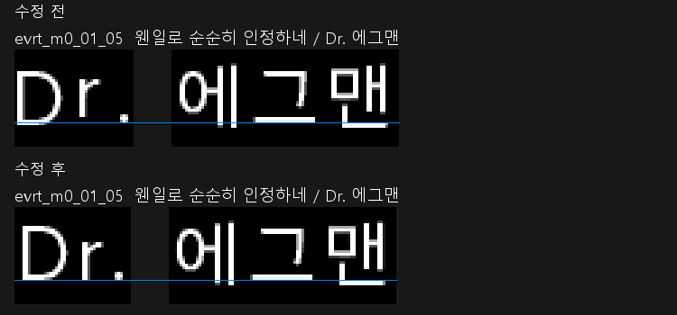

# 컷신 영문 기준선 점검 및 검토본

2026-09-14. 사용자가 HMM 적용본으로 `Dr.` 및 갤러리 15번째 「테일즈의 보고」의 `Excellent!`가 정상 표시됨을 확인했습니다. 같은 버전 1.0.2의 수정 배포에 반영합니다.

## 원인

컷신 글꼴 생성기가 한글은 공통 기준선에 맞추고, 영문은 글자마다 그림의 높이를 기준으로 가운데 정렬하고 있었습니다. 따라서 키가 작은 `r`의 밑선이 `D`보다 3픽셀 위에 놓였습니다. 사용자가 느낀 세로 정렬 어색함과 일치하는 파일상의 문제입니다.

`Dr.`가 나오는 11개 문구의 9개 자막 묶음은 1.0.0과 1.0.2에서 바이트 단위로 동일합니다. 1.0.0에서는 없었다는 버전 차이는 재현하지 못했습니다. 이번 로고 변경이나 다른 모드가 원인이라는 근거도 없습니다.

위 그림은 실제 자막 글자 그림을 3배 확대한 비교이며 인게임 스크린샷은 아닙니다. 파란 선은 비교를 위한 보조선입니다.

## 수정 및 검사 범위

- 번역 데이터 전체에서 영문·숫자가 포함된 1,137행을 목록화했습니다. `{GLYPH:n}` 명령은 제외했습니다. 이 숫자는 번역 상태가 보류된 원문 포함 목록이며, 1,137개 화면을 직접 실행했다는 뜻이 아닙니다.
- 컷신 43개 묶음의 물리적 자막 610행과 글자 ID를 대조했습니다. 누락·길이 불일치 및 영문 대소문자 공유 문제는 발견되지 않았습니다.
- 영문·숫자가 실제 나오는 23개 문구가 속한 16개 묶음을 재생성했습니다. 해당 묶음의 306개 비어 있지 않은 자막 문구를 저장 후 다시 검증했습니다.
- 영문·숫자·ASCII 기호에 공통 기준선을 적용하고 글자 폭에 맞춰 여백을 확보했습니다. 기존 한글 기준선과 대소문자 구분은 유지합니다. 16개 묶음 안의 기호도 새 기준선을 따릅니다.
- 실제 수정 DDS의 ASCII 글자 119개와, 전체 표시 가능한 ASCII 94종을 독립적인 기준선 렌더링과 대조했습니다. 기준선·글자 잘림 검사를 통과했습니다.
- 컷신 밖 공통 글꼴의 영문·숫자 57종에서도 같은 기준선 검사를 통과했습니다. 검사한 7장 공통 글꼴은 설치된 `+Town_EggManBase_Common`의 글꼴과 바이트 단위로 동일합니다.
- 16개 묶음의 빈 셀을 포함한 569개 셀에서 메시지 ID 외 FCO 속성이 동일함을 확인했습니다. XML 등 무관한 멤버도 유지했고, 다시 묶은 16개 파일을 풀어 모든 멤버의 해시가 원래 검토본과 일치하는지 확인했습니다.

이미지로 그린 UI 텍스트와 게임 본체 UI는 컷신의 이 생성기를 사용하지 않습니다. 모든 메뉴·분기·다른 모드 조합을 실제 실행한 시각 검사는 이번 자동 검사에 포함되지 않습니다. 별도 화면에서 이상이 보이면 그 화면 기준으로 추가 점검해야 합니다.

## 사용자 확인

확인 경로: 게임을 새로 실행하여 오프닝의 `웬일로 순순히 인정하네 / Dr. 에그맨` 자막을 확인할 수 있습니다. 다른 컷신의 `Dr.`, `Excellent!`, 숫자와 문장부호도 함께 확인하시면 좋습니다. 영문 폭도 조정했으므로 긴 자막의 줄 배치 역시 실제 화면 확인 대상입니다.

HMM의 기존 한국어 패치 폴더에 검토본이 적용되어 있습니다. 표시 버전은 1.0.2로 유지되며, 모드 옵션·순서·로고는 바꾸지 않았습니다. 새로 만든 1.0.2 배포 ZIP에도 이번 수정을 포함합니다. 이전 ZIP은 별도 보관합니다.

원래 설치 파일은 `Build/LatinBaseline-Audit/InstalledBefore`, 교체 전후 해시는 `Build/LatinBaseline-Audit/install-backup.json`에 보존했습니다. 기존 파일로 되돌릴 때는 이 백업의 같은 이름 파일만 HMM 한국어 패치의 `Inspire/subtitle/English`에 복사하면 됩니다.

## 재현 순서

기존 릴리스·카탈로그·글꼴·Converse·HedgeArcPack이 있는 현재 작업 환경 기준입니다. 생성물은 Git에서 제외되는 `Build/LatinBaseline-Audit`에 저장됩니다. 공개 저장소만으로 원본 게임 리소스 없이 재현되는 절차는 아닙니다.

1. `Scripts/prepare_latin_baseline_audit.py` — 목록 작성, 해시 검증하며 추출 재사용
2. PowerShell 7: `Scripts/export_latin_baseline_fonts.ps1`
3. `Scripts/audit_latin_baselines.py`
4. `Scripts/prepare_latin_baseline_fix.py` — 별도 작업본 준비, 기존 작업본 보존
5. PowerShell 7: `Scripts/build_latin_baseline_review.ps1`
6. PowerShell 7: `Scripts/export_latin_baseline_fonts.ps1 -IndexFile fixed-index.json`
7. `Scripts/verify_latin_baseline_review.py`
8. PowerShell 7: `Scripts/verify_latin_baseline_metadata.ps1`
9. `Scripts/stage_latin_baseline_review.py` — 묶기 및 다시 풀기 검증. `--install`을 붙이면 기존 설치 해시를 검사하고 백업 후 적용합니다.

`package_hmm_release_v102.py`는 기존 번역 변경 뒤에 이 수정본을 필수 반영합니다. `verify_package_v102.py`는 Basic·Full의 자막을 사용자가 확인한 HMM 설치본과 대조합니다. 이전 릴리스 소스는 Git 커밋 `c3cd9f0`에 보존됩니다.
